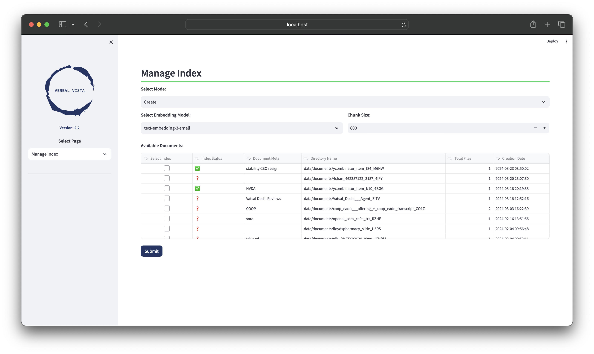
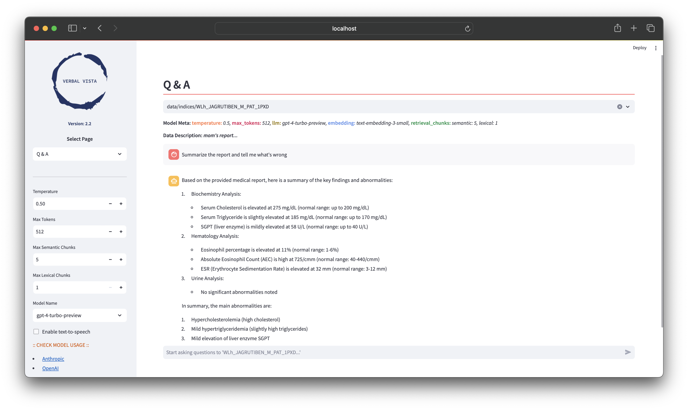

<p align="center">
  
</p>

 [](https://github.com/spate141/VerbalVista/actions/workflows/docker-image.yml) [](https://github.com/spate141/VerbalVista/actions/workflows/create-releases.yml)

## Streamlit Cloud:
- [VerbalVista](https://verbalvista.streamlit.app/)

## Set the keys:
- [Best Practices for API Key Safety](https://help.openai.com/en/articles/5112595-best-practices-for-api-key-safety)
- Edit the .env file at `PATH/TO/VerbalVista/.env` and set following keys
```dotenv
# Reddit
REDDIT_CLIENT_ID=1D1O3N1O2TdS2HcA4R3Ea
REDDIT_CLIENT_SECRET=3D0OaN3O2T8S8HdA6R5E7
REDDIT_USER_AGENT=4D2O2N1O3T7S9H2A3R5E2

# OpenAI
OPENAI_API_KEY=6D6OeN8OcTeS2H6AaR4Ed

# Anthropic
ANTHROPIC_API_KEY=4D62eN5OcTeS3H6AaR2Ed

# Server API
VALID_API_KEYS='KEY1,KEY2,...,KEYn
```

## Docker

### Build docker image:
```cmd
>> cd /path/to/VerbalVista
>> docker build -t verbalvista:3.1 .
```

### Start the docker image:
```cmd
>> docker run -p 8501:8501 -p 8265:8265 -p 8000:8000 -p 6379:6379 \
--env-file .env \
verbalvista:3.1
```

## Streamlit APP

### Start the program:
```cmd
>> streamlit run app.py
```

### Screenshots:

<details>
<summary>Process Media:</summary>


</details>

<details>
<summary>Explore Documents:</summary>


</details>

<details>
<summary>Manage Indices:</summary>


</details>

<details>
<summary>Conversation:</summary>


</details>

<details>
<summary>Stocks:</summary>


</details>

<details>
<summary>Image Generation:</summary>


</details>

## Ray Server Management Script

This README provides guidance on using the `manage_server.sh` script for managing the Ray and application servers in your environment.

### Overview

The `manage_server.sh` script is a utility for easily starting and stopping the Ray server and a custom application server. It streamlines the process of server management through simple command-line commands.

### Prerequisites

- Ensure you have Ray installed in your environment.
- The script should be executable. You can set it as executable using `chmod +x manage_server.sh`.

### FastAPI Documentation:
 
- http://localhost:8000/docs#/

### Usage

Run the script from the command line with the desired command. The script supports the following commands:

1. **start_ray**: Starts the Ray server.
```bash
bash manage_server.sh start_ray
```
2. **start_server [directory]**: Starts the application server with a specified index directory.
```bash
bash manage_server.sh start_server -vvv
```
3. **stop_server**: Stops the application server.
```bash
bash manage_server.sh stop_server
```
4. **stop_ray**: Stops the Ray server.
```bash
bash manage_server.sh stop_ray
```

### Detailed API Endpoint Documentation

#### Health Check
- **Endpoint**: `/health`
- **Method**: GET
- **Description**: Checks the health of the server, ensuring it's operational.
- **Response**: Status message indicating server health.

#### List Indices
- **Endpoint**: `/list/indices`
- **Method**: GET
- **Description**: Retrieves a list of all available indices on the server. Useful for understanding what data is currently indexed and available for querying.
- **Response**: A list of index names.

#### Delete Index
- **Endpoint**: `/delete/{index_name}`
- **Method**: DELETE
- **Description**: Removes a specified index from the server. This endpoint is essential for managing the indices and ensuring that outdated or unnecessary indices can be deleted to maintain optimal server performance and data relevance.
- **Path Parameter**: `index_name` - The unique identifier of the index to be deleted.
- **Response**: Confirmation of the deletion process, along with details of the deleted index or an error message if the index does not exist or cannot be deleted.

#### Chat
- **Endpoint**: `/chat`
- **Method**: POST
- **Description**: Processes a user's query using a specified index and LLM (Large Language Model). This is the core functionality for extracting insights from indexed data.
- **Request Parameters**: Query text, LLM model, embedding model, temperature, max semantic retrieval chunks, max lexical retrieval chunks.
- **Response**: The generated answer to the query along with metadata.

#### Summarize
- **Endpoint**: `/summarize`
- **Method**: POST
- **Description**: Generate a topical summary using a specified index and LLM (Large Language Model). 
- **Request Parameters**: Index name, Summary sentences per topic, LLM model, embedding model, temperature, max semantic retrieval chunks, max lexical retrieval chunks.
- **Response**: The topical summary for the given index along with metadata.

#### Chat History
- **Endpoint**: `/chat/{index_name}`
- **Method**: GET
- **Description**: Get the Q&A chat history for the given index. 
- **Path Parameter**: `index_name` - The unique identifier of the index to get chat history for.
- **Response**: Chat history of the given index along with metadata.

#### Talk
- **Endpoint**: `/talk`
- **Method**: POST
- **Description**: Process user's query and generate response using LLM. 
- **Request Parameters**: Query text, LLM model, temperature
- **Response**: The generated answer to the query along with metadata.
- 
#### Process Multimedia
- **Endpoint**: `/process/multimedia`
- **Method**: POST
- **Description**: Processes uploaded multimedia files, indexes them, and creates a searchable index. This endpoint is crucial for adding new data to the server.
- **Request Parameters**: File to be processed, chunk size, chunk overlap, embedding model, flag for saving to one file.
- **Response**: Metadata about the processed document and the generated index.

#### Process URLs
- **Endpoint**: `/process/urls`
- **Method**: POST
- **Description**: Extracts text from provided URLs, processes this text, and generates an index. This endpoint is useful for indexing web-based data.
- **Request Parameters**: List of URLs, chunk size, chunk overlap, embedding model, flag for saving to one file.
- **Response**: Metadata about the processed URLs and the generated index.

#### Process Text
- **Endpoint**: `/process/text`
- **Method**: POST
- **Description**: Processes raw text input, creates an index, and returns metadata. This endpoint enables indexing of ad-hoc text data.
- **Request Parameters**: Text to be processed, chunk size, chunk overlap, embedding model, flag for saving to one file.
- **Response**: Details about the generated index and text processing.

### Utilizing the API

To interact with these endpoints, you can use tools like `curl` or Postman. For each endpoint, ensure the appropriate HTTP method is used and include the necessary parameters in your request. The `/query` endpoint, for example, requires a POST request with a JSON body containing query parameters.

### Example Usage

To query the system, you might use a command like:

```cmd
curl --location 'http://127.0.0.1:8000/query' \
--header 'Content-Type: application/json' \
--data '{
    "query": "What is the latest research on neural networks?",
    "index_name": "generated_index_id",
    "llm": "gpt-3.5-turbo",
    "embedding_model": "text-embedding-3-small",
    "temperature": 0.5,
    "max_semantic_retrieval_chunks": 5,
    "max_lexical_retrieval_chunks": 1
}
'
```

## Available functions:
  - Media processing
  - Explore documents
  - Manage index
  - Q&A using LLM
  - Tell me about!
  - Stocks performance comparison
